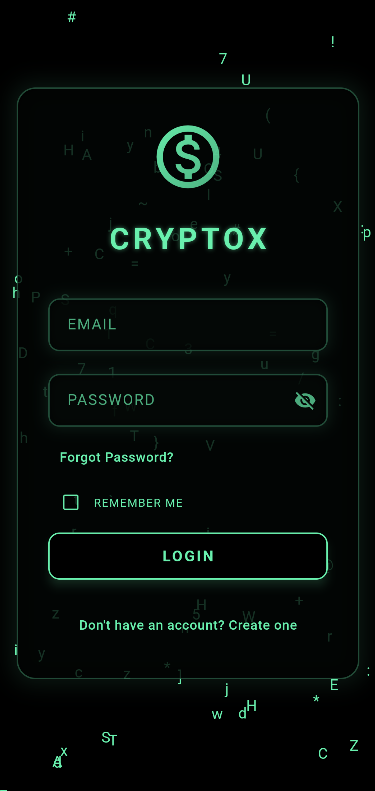

# CryptoX

Cryptox is a Flutter-based application that provides users with real-time cryptocurrency information and a visually appealing Matrix rain effect on the login screen.
The app integrates with Firebase for authentication and uses shared preferences to remember user credentials.

Cryptox is a demo trading app that fetches real-time cryptocurrency data from the CoinGecko API and allows users to trade cryptocurrencies within the app. It also includes a visually appealing Matrix rain effect on the login screen.

The app integrates with Firebase for authentication and uses shared preferences to remember user credentials. User data and portfolio information are stored in Firestore, allowing users to manage their cryptocurrency holdings and view detailed market statistics for each cryptocurrency.


## Table of Contents
- [CryptoX](#cryptox)
- [Table of Contents](#table-of-contents)
- [Technologies](#technologies)
- [Features](#features)
- [Screenshots](#screenshots)
- [Installation](#installation)
- [Usage](#usage)
- [Project Structure](#project-structure)
- [Dependencies](#dependencies)
- [Contributing](#contributing)
- [License](#license)
- [Contact](#contact)


## Technologies
- **Flutter**: A cross-platform UI toolkit for building natively compiled applications for mobile, web, and desktop from a single codebase.
- **Firebase**: A platform developed by Google for creating mobile and web applications.
- **CoinGecko API**: A cryptocurrency data platform that provides real-time and historical cryptocurrency data.
- **Shared Preferences**: A Flutter plugin for reading and writing key-value pairs to the device's local storage.
- **Cloud Firestore**: A flexible, scalable database for mobile, web, and server development from Firebase and Google Cloud Platform.
- **Provider**: A Flutter package for state management that makes it easy to manage app state and rebuild widgets when the state changes.
- **HTTP**: A Flutter plugin for making HTTP requests to a web server.
- **Fl Chart**: A Flutter package for creating beautiful charts and graphs in your app.
- **Flutter Spin kit**: A collection of loading indicators animated with Flutter.
- **Firebase Auth**: A Flutter plugin for Firebase Authentication, enabling users to sign in with their email and password.
- **Firebase Core**: A Flutter plugin for Firebase Core, which provides the basic functionality required to use Firebase services.


## Features
- **Real-time Cryptocurrency Data**: Fetches and displays current prices, market cap, and other relevant information for various cryptocurrencies.
- **Firebase Authentication**: Secure login and signup functionality using Firebase.
- **Firebase Firestore**: Stores user data and portfolio information in Firestore.
- **Matrix Rain Effect**: A visually appealing Matrix rain animation on the login screen.
- **Remember Me**: Option to remember user credentials for automatic login.
- **Portfolio Management**: Allows users to manage their cryptocurrency portfolio.
- **Trade Actions**: Users can buy and sell cryptocurrencies within the app.
- **Market Statistics**: Displays detailed market statistics for each cryptocurrency.
- **Error Handling**: Provides informative error messages for various scenarios.
- **User-friendly Interface**: Simple and intuitive UI for easy navigation.
- **Custom Animations**: Includes custom animations for a more engaging user experience.


## Screenshots



## Installation
1. Clone the repository:
```bash
git clone
```
2. Navigate to the project directory:
```bash
cd cryptox
```
3. Install the required dependencies:
```bash
flutter pub get
```
4. Run the app:
```bash
flutter run
```

## Usage
1. Register a new account or log in with an existing one.
2. View the main screen to see real-time cryptocurrency data.
3. Navigate to the Portfolio tab to manage your cryptocurrency holdings.
4. Buy or sell cryptocurrencies using the Trade button.
5. View detailed market statistics for each cryptocurrency by clicking on its card.
6. View your wallet balance and profit/loss in the Wallet tab.
7. Log out using the Logout button in the Profile tab.
8. Experience a user-friendly interface with custom animations for a more engaging user experience.
9. Welcome to the world of cryptocurrency (demo)trading with Cryptox!

## Project Structure
The project is structured as follows:
- **lib**: 

  - **main.dart**: The entry point of the application.
  
  - **crypto**: 
    - **api_service**: Contains the API service for fetching cryptocurrency data.
    - **crypto**: Contains the data model for cryptocurrency information.
    - **crypto_chart**: Contains the data model for cryptocurrency chart data.
    - **crypto_page**: Contains the page for displaying cryptocurrency data.
    - **crypto_provider**: Contains the provider for managing cryptocurrency data.
    - **portfolio_crypto**: Contains the data model for portfolio cryptocurrencies.

  - **design**: 
    - **app_colors**: Contains the color constants for the application.
    - **cyber_lines_painter**: Contains the custom painter for the Wallet page.
    - **grid_painter**: Contains the custom painter for the Cyber Lines.
    - **matrix**: Contains the Matrix rain animation for the first screens.
    
  - pages:
    -**first**:
      -**login_page**: Contains the login page. 
      -**signup**: Contains the signup page.
      -**forgot_password**: Contains the forgot password page.
  
  - **second**:
    -**home_page**: Contains the home page.
    -**page_controller**: Contains the page controller.
    -**trade_page**: Contains the trade page.
    -**wallet_page**: Contains the wallet page.


## Dependencies
- [firebase_core](https://pub.dev/packages/firebase_core)
- [firebase_auth](https://pub.dev/packages/firebase_auth)
- [cloud_firestore](https://pub.dev/packages/cloud_firestore)
- [shared_preferences](https://pub.dev/packages/shared_preferences)
- [http](https://pub.dev/packages/http)
- [flutter_spinkit](https://pub.dev/packages/flutter_spinkit)
- [fl_chart](https://pub.dev/packages/fl_chart)
- [provider](https://pub.dev/packages/provider)
- [flutter_svg](https://pub.dev/packages/flutter_svg)
- [google_fonts](https://pub.dev/packages/google_fonts)
- [flutter_launcher_icons](https://pub.dev/packages/flutter_launcher_icons)


## License
This project is licensed under the MIT License - see the [LICENSE](LICENSE) file for details.


